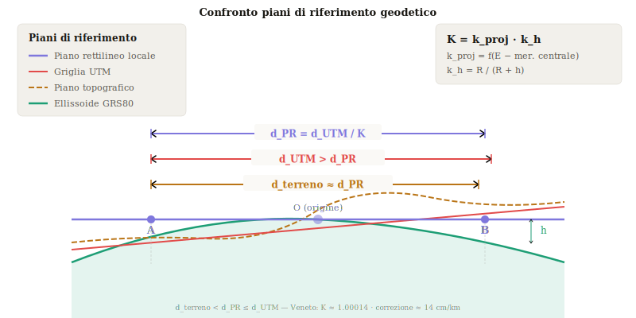
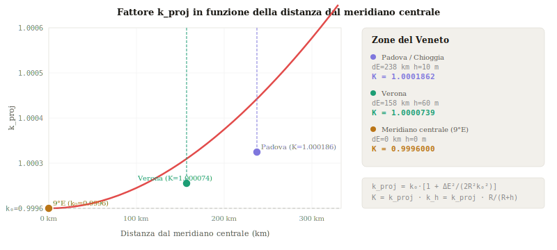
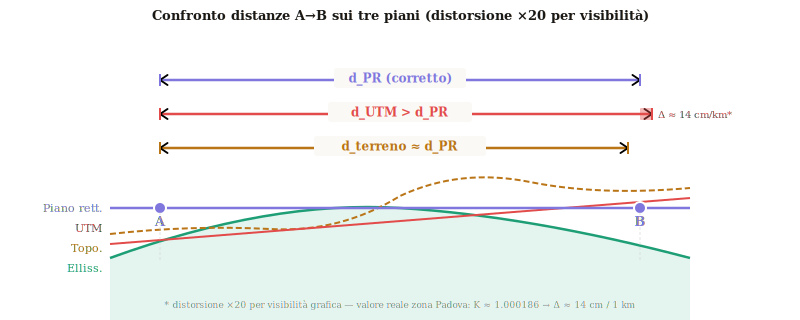
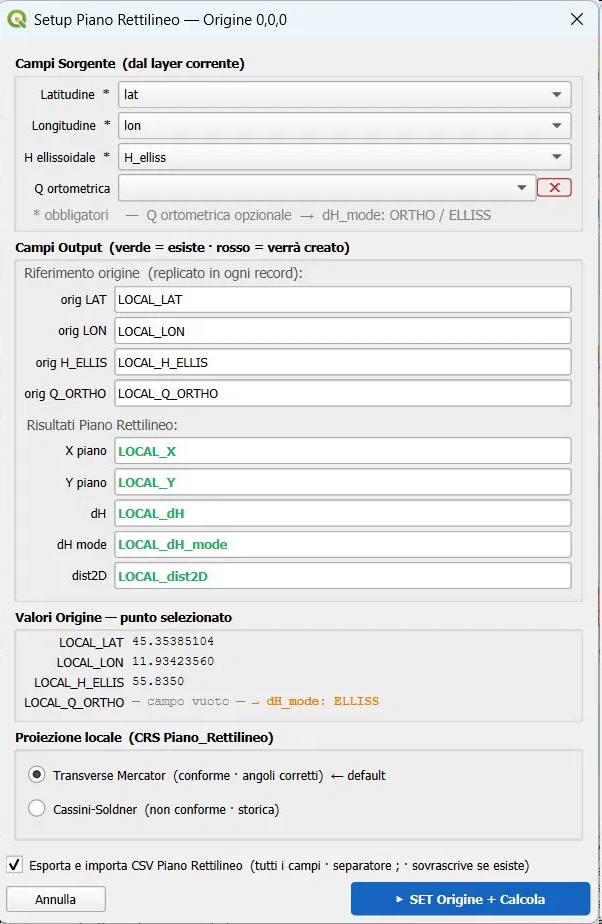
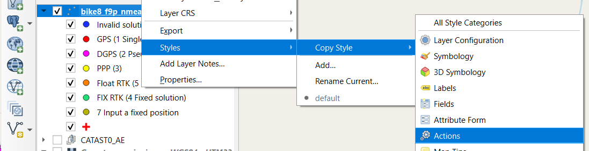
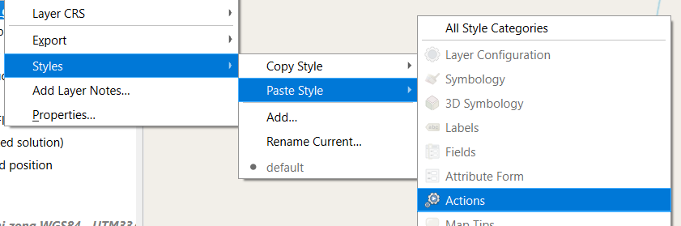
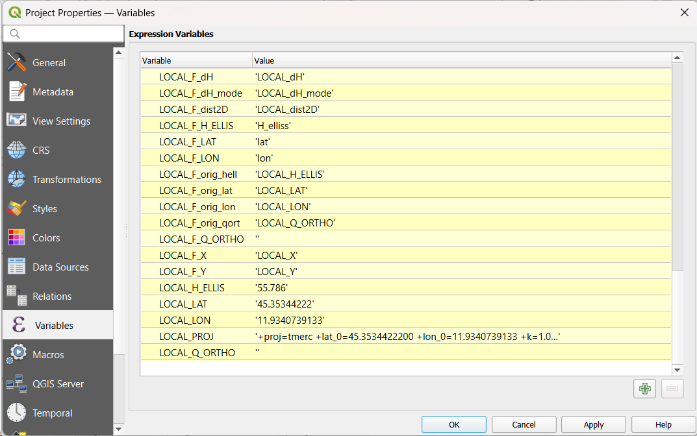
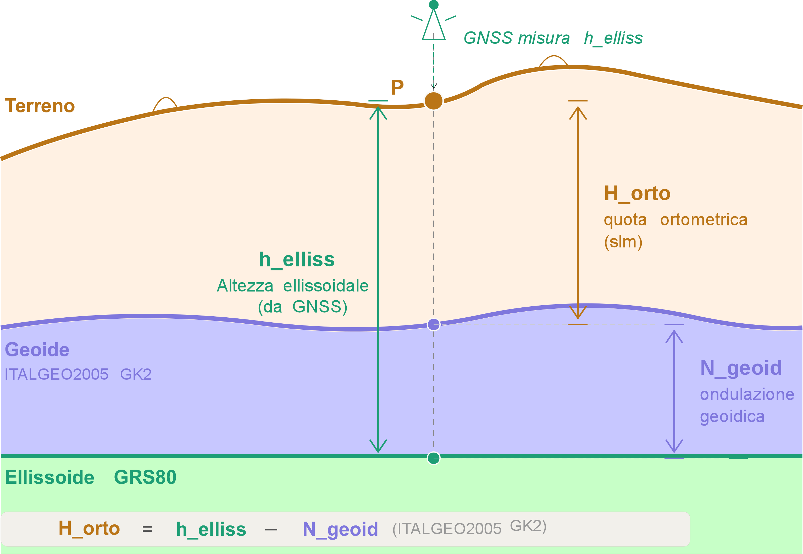

# Piano Rettilineo Locale — Teoria e Implementazione QGIS

> **Nota tecnica** — QGIS Processing - Trasformazione coordinate UTM → piano locale con fattore di scala K combinato  
> 📊 [Pagina pubblicata su GitHub Pages](https://bettellam.github.io/Piano_Rettilineo/Piano_Rettilineo_Locale/Piano_Rettilineo_Locale_Teoria_e_Implementazione_QGIS.html)  
> Ora online e raggiungibile via browser.
> 
> 🔗 Link diretto: https://bettellam.github.io/Piano_Rettilineo/Piano_Rettilineo_Locale/Piano_Rettilineo_Locale_Teoria_e_Implementazione_QGIS.html

---

## Indice

1. [Introduzione](#1--introduzione)
2. [I tre piani di riferimento](#2--i-tre-piani-di-riferimento)
3. [Formule](#3--formule)
4. [Variazione di K in funzione di E e h](#4--variazione-di-k-in-funzione-di-e-e-h)
5. [Confronto distanze A→B](#5--confronto-distanze-ab)
6. [L'azione QGIS: Setup 0,0,0](#6--lazione-qgis-setup-000-piano-rettilineo)
7. [Esempio pratico — zona Veneto](#7--esempio-pratico--zona-veneto)
8. [Altezza ellissoidica, ondulazione geoidica e quota ortometrica](#8--altezza-ellissoidica-ondulazione-geoidica-e-quota-ortometrica)
9. [Progetto QGis di esempio](#9--progetto-qgis-di-esempio)

---

## 1 · Introduzione

Le coordinate UTM (Universal Transverse Mercator) sono coordinate piane rettilinee, ma le
**distanze calcolate sulla griglia non corrispondono alle distanze reali misurate sul terreno**.

Due effetti si sommano:

- **Distorsione di proiezione** — la proiezione cilindrica UTM introduce un fattore di scala
  `k_proj` che varia con la distanza dal meridiano centrale.
- **Riduzione altimetrica** — le misure su terreno a quota `h` devono essere riportate
  all'ellissoide tramite `k_h`.

Il **piano rettilineo locale** è il piano tangente all'ellissoide nel punto di origine scelto dall'operatore. In esso le distanze coincidono con quelle reali al suolo, applicando il fattore combinato **K = k_proj · k_h**.

 È utile distinguere due concetti spesso sovrapposti:

- **Piano tangente locale ENU** — piano geocentrico tangente all'ellissoide nell'origine; le coordinate (Est, Nord, Up) derivano dalla rotazione del sistema ECEF. Non richiede il fattore K esplicito.
- **Sistema cartografico locale (TM/Cassini)** — proiezione cilindrica con origine traslata; le coordinate si ottengono dividendo le coordinate UTM per K. Formalismo topografico classico.

I due approcci sono equivalenti per baseline brevi (< 50 km); il sistema implementa la formulazione geocentrica rigorosa (ECEF→ENU), che incorpora automaticamente curvatura e riduzione altimetrica senza applicazione esplicita di K.

---

## 2 · I tre piani di riferimento

In un rilievo GNSS convivono tre superfici di misura distinte, geometricamente *sghembe* tra loro:

| Piano | Colore | Caratteristica |
|---|---|---|
| **Piano rettilineo locale** | 🟣 viola | Tangente all'ellissoide in O — distanze reali |
| **Griglia UTM** | 🔴 rosso | Proiezione cilindrica — distanze > reali (zona Veneto) |
| **Piano topografico** | 🟡 ambra | Superficie fisica a quota h |
| **Ellissoide GRS80** | 🟢 verde | Superficie di riferimento geodetico |



*Fig. 1 — I tre piani di riferimento: piano rettilineo locale (viola), griglia UTM (rosso),
piano topografico (ambra) ed ellissoide GRS80 (verde).*

---

## 3 · Formule

### 3.1 Fattore di scala della proiezione UTM

Il fattore di scala `k_proj` dipende dalla distanza `ΔE = E − 500 000` dal meridiano centrale della zona UTM:

```
k_proj(E) = k₀ · [ 1 + ΔE² / (2R²k₀²) ]

dove:  k₀ = 0.9996  (scala nominale UTM)
        R = 6 371 000 m
       ΔE = E − 500 000 m
```

> **Nota — Approssimazione di Taylor al 2° ordine:**
> la formula adottata è l'espansione della formula Transverse Mercator sferica completa:
> ```
> k_TM(ΔE) = k₀ · cosh( ΔE / (R · k₀) )
>          = k₀ · [1 + ΔE²/(2R²k₀²) + ΔE⁴/(24R⁴k₀⁴) + …]
> ```
> Il termine trascurato (4° ordine) per ΔE = 300 km vale ≈ **0.09 ppm** — trascurabile per qualsiasi applicazione pratica.
> Nella formulazione ellissoidale rigorosa (GRS80), R è sostituito dal raggio di curvatura N(φ), introducendo una dipendenza dalla latitudine qui omessa.
>

**Proprietà chiave:** nell'approssimazione adottata, `k_proj` dipende **prevalentemente dalla distanza dal meridiano centrale** (ΔE). La dipendenza dalla latitudine φ, presente nella formulazione rigorosa tramite il raggio di curvatura, è trascurabile per le aree di applicazione tipiche.

### 3.2 Riduzione altimetrica

Le distanze al suolo a quota `h` devono essere ridotte all'ellissoide:

```
k_h = R / (R + h)

dove:  h = quota ellissoidale media del rilievo (m)
```

### 3.3 Fattore combinato K

```
K = k_proj · k_h
```

### 3.4 Trasformazione coordinate UTM → Piano rettilineo

Definita l'origine `(E₀, N₀)`, le coordinate nel piano locale sono:

```
x_piano = (E_UTM − E₀) / K
y_piano = (N_UTM − N₀) / K
```

### 3.5 Metodo ECEF→ENU (implementato nell'azione QGIS)

Il fattore K descrive la relazione UTM→locale nel formalismo topografico classico (sezione 3.4). L'implementazione ECEF→ENU costituisce la formulazione geocentrica rigorosa dello stesso concetto: la rotazione della terna geocentrica incorpora automaticamente curvatura ellissoidale e riduzione altimetrica, rendendo superflua l'applicazione esplicita di K. I campi `local_e` e `local_n` sono quindi equivalenti a `x_piano` e `y_piano`, ma calcolati senza approssimazioni intermedie.

La procedura QGIS predisposta utilizza la trasformazione rigorosa Geocentrica→ENU, che non richiede K esplicito perchè incorpora automaticamente curvatura e riduzione:

```
[X,Y,Z]_ECEF  ←  geodeticToECEF(lat, lon, h) 

dX = X_rover − X_base
dY = Y_rover − Y_base
dZ = Z_rover − Z_base

local_e =  −sinλ · dX  +  cosλ · dY
local_n =  −sinφ·cosλ · dX  −  sinφ·sinλ · dY  +  cosφ · dZ
local_u =   cosφ·cosλ · dX  +  cosφ·sinλ · dY  +  sinφ · dZ

dove  φ,λ = lat,lon del punto base (origine) — ellissoide GRS80
```

La quota differenziale usa il modello geoidico **ITALGEO2005 GK2**:

```
local_dH = H_orto_rover − H_orto_base
         = (h_rover − N_geoid_rover) − LOCAL_Q_ORTHO

LOCAL_Q_ORTHO = quota ortometrica in origine  (h_elliss − N_geoid, ITALGEO2005 GK2)

GK2 6706 RDN2008  →  RTK Fix  (fix_quality = 4)
GK2 4258 ETRS89   →  RTK Float (fix_quality = 5)
```
> **Fix Quality e modello geoidico:**
> In un rilievo RTK/NRTK il ricevitore lavora in *Float RTK* (fix_quality = 5) quando ha ricevuto
> le correzioni differenziali dalla base ma non ha ancora risolto le **ambiguità intere di fase portante**
> (stimazione reale tramite minimi quadrati — algoritmo LAMBDA). Precisione planimetrica tipica: **20–50 cm** (1σ), significativamente inferiore al centimetro del Fix RTK (fix_quality=4).
>
> Il Float si verifica normalmente:
> - nella fase di inizializzazione del ricevitore (convergenza, da pochi secondi a qualche minuto);
> - in presenza di mascheramenti satellitari parziali (edifici, vegetazione);
> - quando il numero di satelliti visibili scende sotto la soglia critica per il fixing.
>
> È da ritenersi corretto utilizzare in Float RTK il modello geoidico ITALGEO2005 GK2 in EPSG 4258 (ETRS89),
> coerentemente con la minore precisione altimetrica attesa. In Fix RTK viene applicato il modello in
> EPSG 6706 (RDN2008), realizzazione nazionale italiana di ETRS89 e datum di riferimento delle reti NTRIP italiane più diffuse.

---

## 4 · Variazione di K in funzione di E e h



*Fig. 2 — Curva di k_proj in funzione della distanza dal meridiano centrale UTM 32N (9°E).
Marcati i valori per le principali zone del Veneto.*

| Area | dE (km) | h (m) | k_proj | k_h | K totale | Δd / km |
|---|---|---|---|---|---|---|
| Padova / Chioggia | 238 | 10 | 1.0001878 | 0.9999984 | **1.0001862** | 18.6 cm |
| Vicenza | 200 | 40 | 1.0001330 | 0.9999937 | **1.0001267** | 12.7 cm |
| Verona | 158 | 60 | 1.0000833 | 0.9999906 | **1.0000739** | 7.4 cm |
| Cortina d'Ampezzo | 176 | 1224 | 1.0001036 | 0.9998081 | **0.9999118** | 8.8 cm |
| Meridiano centrale (9°E) | 0 | 0 | 0.9996000 | 1.0000000 | **0.9996000** | 40.0 cm |

> Per rilievi < 30 km un singolo K calcolato al punto medio è sufficiente (errore < 1 mm).

---

## 5 · Confronto distanze A→B



*Fig. 3 — Confronto delle tre distanze A→B sui rispettivi piani di riferimento.
La distorsione è amplificata per renderla visibile graficamente.*

> 🎬 Per la versione animata vedere la [relazione interattiva](https://bettellam.github.io/Piano_Rettilineo/Piano_Rettilineo_Locale/Piano_Rettilineo_Locale_Teoria_e_Implementazione_QGIS.html).

---

## 6 · L'azione QGIS: Setup 0,0,0 Piano Rettilineo

La procedura QGIS predisposta è installata come **Python Action** (trigger: Canvas click) sul layer di rilievo.
Al click su un punto, quel punto diventa l'origine del piano locale e tutti i record vengono ricalcolati.


### 6.1 Flusso operativo

1. Click su un punto RTK Fix nel Map Canvas
   └─ il punto diventa l'origine (E₀, N₀, h₀)

2. Dialogo Setup — configurazione campi
   ├─ Combobox: lat, lon, H_elliss, Q_ortometrica
   ├─ Campi output: verde = esiste, rosso = verrà creato
   └─ Proiezione: Transverse Mercator (default) o Cassini-Soldner

3. Calcolo ECEF→ENU su tutti i record
   └─ Scrittura batch con changeAttributeValues

4. Export CSV + import come nuovo layer
   ├─ nome auto-incrementato: _PR01.csv, _PR02.csv, …
   ├─ X=LOCAL_X, Y=LOCAL_Y, separatore ;
   └─ CRS (PROJ string anonimo) serializzato inline nel .qgs




> **Come trasferire le azioni su un altro layer:**
> tasto destro sul layer → *Styles → Copy Style → Actions*,
> poi sul layer destinazione → *Styles → Paste Style → Actions*.

<div style="display:flex; gap:1rem; flex-wrap:wrap;">
  &nbsp;&nbsp;&nbsp;
  
</div>


### 6.2 Campi calcolati nel layer

| Campo | Tipo | Contenuto |
|---|---|---|
| `LOCAL_LAT` | Double | Latitudine origine O |
| `LOCAL_LON` | Double | Longitudine origine O |
| `LOCAL_H_ELLIS` | Double | Quota ellissoidale origine |
| `LOCAL_Q_ORTHO` | Double | Quota ortometrica origine — ITALGEO2005 GK2 |
| `LOCAL_X` | Double | Coordinata E nel piano locale (m) |
| `LOCAL_Y` | Double | Coordinata N nel piano locale (m) |
| `LOCAL_dH` | Double | Differenza quota ortometrica da origine |
| `LOCAL_dH_mode` | String | `ORTHO` (GK2 RDN2008) oppure `ELLISS` (fallback) |
| `LOCAL_dist2D` | Double | Distanza planimetrica da origine √(X²+Y²) |


### 6.3 Variabili di progetto QGIS

| Variabile | Contenuto |
|---|---|
| `LOCAL_LAT` / `LOCAL_LON` | Coordinate geografiche origine corrente |
| `LOCAL_H_ELLIS` | Quota ellissoidale origine |
| `LOCAL_Q_ORTHO` | Quota ortometrica origine (ITALGEO2005 GK2) |
| `LOCAL_PROJ` | PROJ string completo per il CRS del layer CSV |
| `LOCAL_F_LAT/LON/H_ELLIS/Q_ORTHO` | Nomi campi sorgente nel layer |
| `LOCAL_F_X/Y/dH/dH_mode/dist2D` | Nomi campi risultato |



*Fig. 6 — Variabili `LOCAL_*` impostate dall'azione Setup 0,0,0 nel pannello Project Properties → Variables.*

> **Nota sul CRS**: il PROJ string in `LOCAL_PROJ` viene applicato via
> `QgsCoordinateReferenceSystem.createFromProj()` creando un CRS anonimo (senza `USER:XXXXX`).
> QGIS serializza la definizione inline nel `.qgs` — il progetto è portabile su qualsiasi macchina
> senza configurazioni aggiuntive.

---

## 7 · Esempio pratico — zona Veneto

Rilievo GNSS RTK in zona Padova (UTM 32N), quota media 10 m slm, distanza dal meridiano centrale 238 km:

```
k_proj(238 km) = 0.9996 · [1 + (238000)² / (2 · 6371000² · 0.9996²)]
               = 1.00018780

k_h(10 m)      = 6371000 / (6371000 + 10)
               = 0.99999843

K              = 1.00018780 · 0.99999843
               = 1.00018623

Correzione su 1 km  : (K−1) · 1000     =  186 mm
Correzione su 12 km : (K−1) · 12000    =  2.23 m
```

Un rilievo di 12 km in questa zona produce distanze UTM superiori di **circa 2 m** rispetto
alle distanze nel piano locale (ridotte al piano tangente). Il piano rettilineo locale elimina questa distorsione.

---

## 8 · Altezza ellissoidica, ondulazione geoidica e quota ortometrica

### 8.1 Le tre quote

In geodesia si distinguono tre grandezze altimetriche distinte:

```
h_elliss  =  quota ellissoidale       [misurata dal GNSS rispetto a GRS80]
N_geoid   =  ondulazione del geoide   [separazione geoide-ellissoide]
H_orto    =  quota ortometrica (slm)  =  h_elliss − N_geoid
```

Il GNSS fornisce direttamente `h_elliss`. La quota ortometrica — quella fisicamente
significativa per un topografo, corrispondente al "livello del mare" — si ottiene
sottraendo l'ondulazione del geoide.



*Fig. 4 — Le tre superfici di riferimento geodetico e le tre quote. Il GNSS misura direttamente `h_elliss`; sottraendo l'ondulazione `N_geoid` (da ITALGEO2005 GK2) si ottiene `H_orto`.*

### 8.2 Il modello ITALGEO2005 GK2

Il sistema utilizza il modello italiano di ondulazione del geoide **ITALGEO2005**
distribuito da IGM in formato griglia `.gk2`:

| Variante | EPSG | Sistema di riferimento | Uso nel sistema |
|---|---|---|---|
| GK2 ETRS89 | 4258 | ETRS89 | RTK Float (fix_quality = 5) |
| GK2 RDN2008 | 6706 | RDN2008 | RTK Fix (fix_quality = 4) |

La scelta di applicare il modello più preciso (RDN2008) solo in condizione di Fix è
intenzionale: la precisione centimetrica del Fix giustifica la correzione geoidica rigorosa,
mentre in Float la precisione decimettrica rende la differenza tra i due modelli è trascurabile.

### 8.3 Effetto sulla componente verticale

Il metodo ECEF→ENU calcola `local_u` come differenza di quote **ellissoidali**:

```
local_u ≈ h_elliss_rover − h_elliss_base
```

Questo non coincide con la differenza di quote ortometriche se l'ondulazione del geoide
varia tra i due punti:

```
local_dH = H_orto_rover − H_orto_base
         = (h_elliss_rover − N_rover) − (h_elliss_base − N_base)
         = local_u − (N_rover − N_base)
```

Il termine `ΔN = N_rover − N_base` è la **variazione dell'ondulazione** tra origine e punto rover.

### 8.4 Entità della correzione — zona Veneto

| Scenario | ΔN tipico | Effetto su local_dH |
|---|---|---|
| Baseline < 10 km, pianura | 1–3 mm | trascurabile |
| Baseline 30–50 km, NTRIP | 5–15 mm | borderline per precisione cm |
| Costa → Dolomiti | 20–60 mm | **non trascurabile** |
| Meridiano centrale → costa adriatica | 40–80 mm | significativo |

### 8.5 Come viene gestito nel progetto

Il calcolo di `local_dH` è separato da quello planimetrico proprio per questo motivo:

```
# Componente planimetrica — usa h_elliss in ECEF→ENU (corretto)
local_e, local_n  ←  geodeticToECEF(lat, lon, h_elliss) → rotazione ENU

# Componente verticale — usa quota ortometrica (rigorosa)
N_rover           ←  interpolaGK2_6706(lat_rover, lon_rover)
H_orto_rover      =   h_elliss_rover − N_rover
local_dH          =   H_orto_rover − LOCAL_Q_ORTHO
```

dove `LOCAL_Q_ORTHO` è la quota ortometrica dell'origine, calcolata una sola volta
al momento del SET 0,0,0 con lo stesso modello GK2.

### 8.6 Componente planimetrica — perché non serve la quota ortometrica

Usare `H_orto` al posto di `h_elliss` in `geodeticToECEF` **non introduce alcun errore planimetrico**.

La dimostrazione è diretta: sostituire `H_orto` introduce in ECEF un errore puramente radiale:

```
ΔX = −N_geoid · cosφ · cosλ
ΔY = −N_geoid · cosφ · sinλ
ΔZ = −N_geoid · sinφ
```

Applicando la rotazione ENU a questo errore radiale:

```
e_err = −sinλ·ΔX + cosλ·ΔY                           = 0        ← si annulla
n_err = −sinφcosλ·ΔX − sinφsinλ·ΔY + cosφ·ΔZ         = 0        ← si annulla
u_err =  cosφcosλ·ΔX + cosφsinλ·ΔY + sinφ·ΔZ          = −N_geoid ← solo in verticale
```

Un errore radiale si proietta **a zero in orizzontale** e pari a `−N_geoid` in verticale.
Questo giustifica geometricamente la separazione nel sistema: `h_elliss` per la planimetria
(ECEF→ENU) e il modello geoidico ITALGEO2005 GK2 per la quota ortometrica (`local_dH`).
I due calcoli sono indipendenti e complementari.

> **Sintesi**: la quota geoidica non influisce sulla planimetria. Influisce solo
> sul componente verticale `local_dH`, dove viene applicata correttamente tramite ITALGEO2005 GK2.


## 9 · Progetto QGis di esempio

Nel progetto in allegato è presente il file NMEA point di test **bike8_f9p_nmea_gnss_6706** (Test_Piano_Rettilineo.gpkg) con le azioni QGIS attive. 
Usare Copy/Past Style per trasferirle ad un altro file rilievo GNSS.

```
**Azione: Set 0,0,0 Piano rettilineo.**
UTILIZZO:
    Clicca su un punto nel Map Canvas con il layer attivo.
    Il punto cliccato diventa l'origine (0,0,0) del piano locale.
    Tutti i record del layer vengono aggiornati con X, Y, dH, dist2D.
```

```
**Azione: Cerchi Distanza su 0,0,0**
  UTILIZZO:
    Clicca su una qualsiasi feature del layer corrente.
    La feature cliccata non viene usata — i cerchi si centrano
    sempre su LOCAL_LAT / LOCAL_LON (variabili di progetto).
    Legge LOCAL_LAT e LOCAL_LON dalle variabili di progetto
    (impostate dall'azione "Setup 0,0,0 Piano Rettilineo") e disegna cerchi
    geodetici a 1, 2, 5, 10, 20 km in un layer virtuale.
```
> 🔗 Link diretto: https://bettellam.github.io/Piano_Rettilineo/Piano_Rettilineo_Locale/QGIS_Piano_Rettilineo.zip

---

*Generato con QGIS 3.44 · Python 3.12 · ITALGEO2005 GK2 (EPSG 4258 / 6706)* · Claude AI
